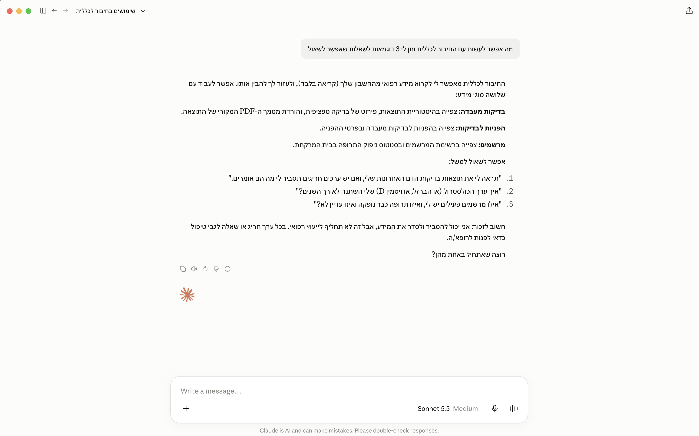
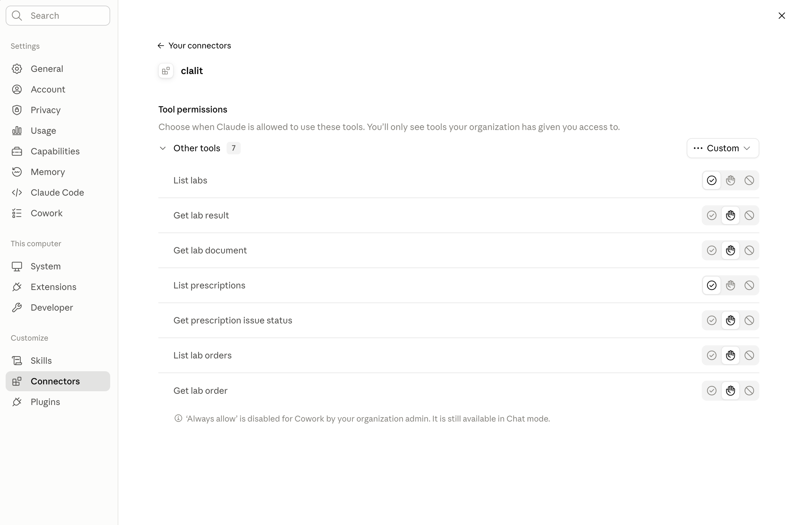

# Clalit Health

**Read your own Clalit records (lab results, prescriptions, lab orders) from a CLI or an AI assistant (MCP).**

[](LICENSE)

> Unofficial. Not affiliated with Clalit. Not a substitute for the official portal or clinical advice.

The MCP server runs locally on your machine: you log in through your own browser, the session is stored only on your computer, and this project has no hosted backend and collects nothing. Note that whatever results your AI client (such as Claude) requests are passed to that client and are handled under its provider's privacy terms.



## Getting started with an AI assistant

Copy and paste this to your agent:

```
Read my Clalit lab results from the last year and summarize anything out of range, then list my active prescriptions.

https://raw.githubusercontent.com/netanelavr/clalit-mcp/main/skills/clalit-mcp/SKILL.md
```

Or install the skill locally:

```sh
npx skills add netanelavr/clalit-mcp
```

## Terms of use

- **Own account only.** Never use this against someone else's record.
- **Read-only.** No booking, payments, profile writes, or prescription requests.
- **No CAPTCHA / bot / Imperva bypass.** You solve CAPTCHA and enter the SMS OTP yourself.
- **Residential machine.** Datacenter and many cloud IPs get Imperva Error 16; log in on your own Mac / home network.
- **Session file is secret.** Stored mode `0600` under `~/.config/clalit-mcp/`. Never commit or paste it.

## Install

```sh
git clone https://github.com/netanelavr/clalit-mcp.git
cd clalit-mcp
npm install
npm test
```

## Sign in and CLI

```sh
npx tsx packages/cli/src/main.ts login
npx tsx packages/cli/src/main.ts labs --json
npx tsx packages/cli/src/main.ts lab --ref <token-from-labs> --json
npx tsx packages/cli/src/main.ts lab-document --ref <token> --out result.pdf
npx tsx packages/cli/src/main.ts prescriptions --json
npx tsx packages/cli/src/main.ts lab-orders --json
npx tsx packages/cli/src/main.ts lab-order --ref <token-from-lab-orders> --json
npx tsx packages/cli/src/main.ts help
```

`login` opens a loopback browser page for ID, CAPTCHA, and SMS OTP. See [docs/LIVE-VERIFY.md](docs/LIVE-VERIFY.md).

## MCP

Sign in first (`login` above); the MCP server reuses that local session.

### Claude Desktop

Edit `~/Library/Application Support/Claude/claude_desktop_config.json` (macOS). Use **absolute paths** (Dock-launched Claude does not see `nvm` / shell `PATH`):

```json
{
  "mcpServers": {
    "clalit": {
      "command": "/absolute/path/to/node",
      "args": [
        "/absolute/path/to/clalit-mcp/node_modules/.bin/tsx",
        "/absolute/path/to/clalit-mcp/packages/cli/src/main.ts",
        "mcp"
      ]
    }
  }
}
```

Find your node path with `which node`. Quit Claude fully (Cmd+Q) and reopen.



### Other MCP clients (Cursor, Claude Code, …)

```json
{
  "mcpServers": {
    "clalit": {
      "command": "npx",
      "args": ["tsx", "packages/cli/src/main.ts", "mcp"],
      "cwd": "/absolute/path/to/clalit-mcp"
    }
  }
}
```

### Tools

`list_labs`, `get_lab_result`, `get_lab_document`, `list_prescriptions`, `get_prescription_issue_status`, `list_lab_orders`, `get_lab_order`

## License

[MIT](LICENSE)
